# <!-- fit --> Nemo 상가 데이터 EDA 심층 분석

**강남권 상업용 부동산 시장의 다이내믹스**

작성일: 2026-04-28
분석가: 20년 경력 수석 데이터 애널리스트 Antigravity

<!--
(발표 시작 - 0:00~2:00)
여러분, 안녕하십니까. 오늘 저는 대한민국 상업용 부동산의 심장부라 할 수 있는 '강남권 상가 시장'을 데이터라는 렌즈를 통해 심층적으로 분석한 결과를 발표하고자 합니다. 
이번 분석은 단순히 '어느 지역이 비싸다'는 식의 현상 나열을 넘어, 네모 플랫폼에서 수집된 673개의 실시간 매물 데이터를 바탕으로 시장의 숨겨진 엔진이 어떻게 돌아가고 있는지, 그리고 그 안에서 우리가 어떤 전략적 기회를 포착해야 하는지를 다룹니다.
데이터는 2026년 4월 말 기준이며, 강남의 복잡다단한 임대차 관계와 업종별 생태계를 정량적으로 파악하는 데 주력했습니다. 20년 경력의 데이터 애널리스트로서 제가 발견한 강남의 진짜 얼굴을 지금부터 하나씩 보여드리겠습니다.
발표 순서는 데이터 개요부터 시작하여 수치적 진단, 공급 구조 분석, 그리고 11가지 핵심 시각화 지표를 거쳐 마지막 전략적 제언으로 마무리하겠습니다. 
-->

---

## 0. 데이터 개요 및 정제 결과

- **전체 규모**: 673개 매물 정보
- **변수 구성**: 40개 컬럼 (수치형 9개, 범주형 및 텍스트 포함)
- **분석 대상**: 네모 플랫폼의 강남권 상가 임대/매매 데이터
- **정제 상태**: 중복 0건, 정제 완료

> "단순한 수치를 넘어 상권의 생태계를 읽습니다."

<!--
(데이터 개요 - 2:00~4:00)
본격적인 분석에 앞서 우리가 다룬 데이터의 신뢰성을 먼저 짚고 넘어가겠습니다. 분석에 사용된 데이터는 총 673개의 강남권 상가 매물입니다. 변수는 총 40개 컬럼으로 구성되어 있으며, 단순한 가격 정보뿐만 아니라 조회수, 관심등록수와 같은 시장 참여자들의 행동 데이터까지 포함하고 있어 입체적인 분석이 가능했습니다.
데이터 정제 과정에서 가장 공을 들인 부분은 중복 데이터의 제거입니다. 부동산 플랫폼 특성상 동일 매물이 중복 등록되는 경우가 많은데, 이를 엄격하게 필터링하여 분석의 왜곡을 방지했습니다. 
이 673개의 매물은 현재 강남 시장의 표준적인 흐름을 반영하고 있습니다. 우리는 이 데이터를 통해 '강남 상가는 왜 이런 가격을 형성하는가?' 그리고 '시장은 지금 어떤 업종을 원하고 있는가?'라는 질문에 답을 찾아갈 것입니다.
-->

---

## 1. 수치 데이터 진단: 시장의 양극화

- **보증금(Deposit)**: 평균 6,900만 원 (표준편차 9,900만 원)
  - 소형 사무실부터 수억 원대 플래그십 스토어까지 혼재
- **월세(Monthly Rent)**: 평균 534만 원 (최대 9,000만 원)
  - 전형적인 '롱테일' 분포, 상위 25%가 시장 지수 견인
- **권리금(Premium)**: 중위수 0원 vs 최대 9억 원
  - 무권리 매물 증가와 핵심 입지 가치의 공존

<!--
(수치 진단 - 4:00~6:00)
강남 시장을 한 단어로 요약하면 '양극화'입니다. 보증금 데이터를 보시면 평균은 6,900만 원이지만, 표준편차가 9,900만 원에 달합니다. 이는 평균값이 사실상 큰 의미가 없을 정도로 매물 간 격차가 극심하다는 뜻입니다. 2,000만 원대 소형 오피스부터 10억 원이 넘는 랜드마크 매물이 한 바구니에 담겨 있습니다.
월세 역시 마찬가지입니다. 평균 534만 원이지만 상위 25%의 고가 매물들이 전체 평균을 끌어올리고 있습니다. 여기서 우리가 주목해야 할 점은 권리금입니다. 중위수가 0원이라는 것은 현재 시장에 '무권리' 매물이 상당수 존재한다는 실무적 신호를 줍니다. 경기 불황의 영향일 수도 있고, 상권의 세대교체가 빠르게 일어나고 있다는 증거이기도 합니다. 하지만 최대 권리금이 9억 원에 달하는 매물이 존재한다는 사실은, 검증된 핵심 입지의 가치는 여전히 견고하다는 대조적인 현실을 보여줍니다.
-->

---

## 2. 공급 구조: F&B와 1층 중심의 시장

- **업종 구성**: 음식점/서비스업/휴게음식점이 60% 이상 점유
  - 강남권 상권의 '체험형 소비' 재편 증명
- **가격 유형**: 99% 이상이 '임대' 매물
  - 운영 목적의 임차인 중심 시장 형성
- **층수 전략**: 1층 압도적 비중 (접근성/노출도 중시)
  - 최근 SNS 마케팅을 활용한 고층부 '목적형 매장' 출현 포착

<!--
(공급 구조 - 6:00~8:00)
다음은 공급 구조입니다. 강남 상가는 지금 무엇으로 채워져 있을까요? 분석 결과 음식점과 서비스업, 카페 같은 휴게음식점이 전체의 60%를 넘습니다. 이는 강남 상권이 단순히 물건을 파는 곳이 아니라, 먹고 마시고 체험하는 '소비의 목적지'로 완전히 재편되었음을 뜻합니다.
또한, 매매보다는 임대가 99% 이상을 차지합니다. 이는 자산 투자 목적보다는 실제 운영을 하려는 임차인들의 활동이 시장의 메인 동력이라는 점을 시사합니다.
층수 데이터를 보면 여전히 '1층 선호 사상'이 뚜렷합니다. 하지만 최근 재미있는 현상이 발견됩니다. SNS를 통한 목적형 방문이 늘어나면서, 1층의 높은 임대료를 피해 고층부로 올라가는 트렌디한 매장들이 늘고 있다는 점입니다. 이는 뒤에서 층별 임대료 데이터를 통해 더 자세히 확인해 보겠습니다.
-->

---

## 시각화 1: 월세 분포 (Monthly Rent Dist)

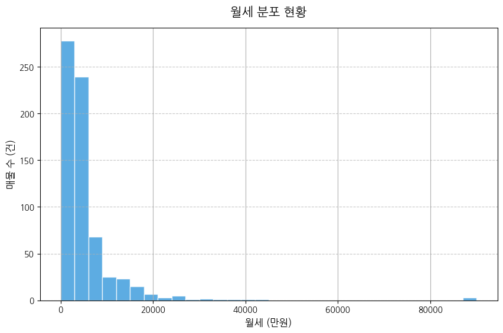

- **집중 구간**: 300~500만 원대 밀집
- **인사이트**: 강남 진입을 위한 표준 고정비용 형성
- **제언**: 1,000만 원 이상 고가 매물은 철저한 매출 검증 필요

<!--
(시각화 1 - 8:00~10:00)
이 그래프는 월세의 분포를 보여줍니다. 보시다시피 300만 원에서 500만 원 사이에 가장 많은 매물이 몰려 있습니다. 이것이 바로 강남에서 사업을 시작하기 위해 지불해야 하는 '표준 입장료'라고 보시면 됩니다.
비즈니스 관점에서 이 구간은 경쟁이 가장 치열한 레드오션이기도 하지만, 반대로 시장에서 가장 수요와 공급이 활발하게 일어나는 '현금 흐름의 중심'입니다.
오른쪽 롱테일 구간에 위치한 1,000만 원 이상의 매물들은 단순히 입지가 좋다고 들어갈 것이 아니라, 그 임대료를 감당할 수 있는 객단가와 회전율이 나오는지 철저한 시뮬레이션이 선행되어야 함을 경고합니다.
-->

---

## 시각화 2: 보증금 vs 월세 상관관계

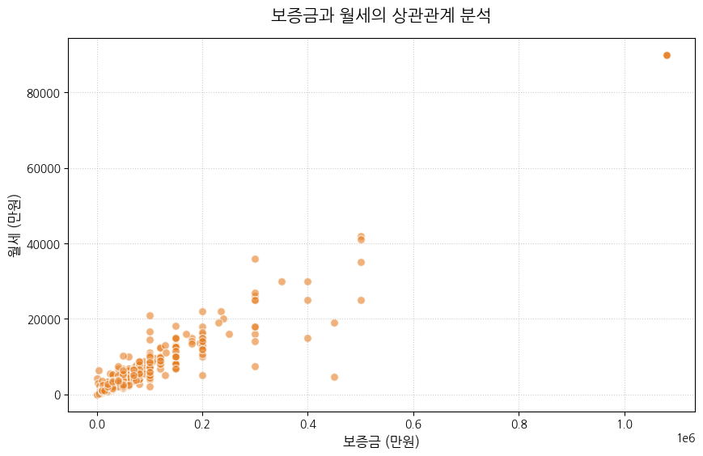

- **상관계수**: **0.95** (강한 양의 선형 관계)
- **인사이트**: 매우 논리적인 임대료 산정 체계
- **제언**: 추세선 이탈 매물은 특수 사정 확인 필수

<!--
(시각화 2 - 10:00~12:00)
보증금과 월세의 상관관계를 나타낸 산점도입니다. 상관계수가 0.95입니다. 거의 완벽에 가까운 선형 관계죠. 이는 강남 시장의 임대료 산정 체계가 매우 투명하고 논리적으로 작동하고 있다는 뜻입니다. 소위 '눈먼 매물'이나 '가격 오류'가 거의 없다는 의미이기도 합니다.
하지만 우리 같은 분석가들이 주목해야 할 지점은 이 추세선에서 멀리 떨어진 '아웃라이어(Outlier)'들입니다. 보증금은 낮은데 월세가 비정상적으로 높거나, 그 반대인 경우죠. 이런 매물들은 급매물이거나, 권리 관계가 복잡하거나, 혹은 건물의 중대한 결함이 있을 확률이 높으므로 현장 실사 시 가장 먼저 체크해야 할 포인트입니다.
-->

---

## 시각화 3: 업종별 공급 현황

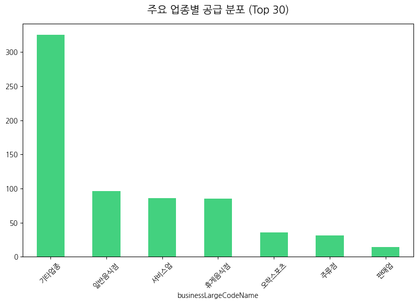

- **핵심 업종**: 음식점 및 서비스업 압도적
- **인사이트**: 강남은 '복합 소비 상권'
- **제언**: 레드오션인 음식점 대신 차별화된 컨셉/틈새 상권 발굴 필요

<!--
(시각화 3 - 12:00~14:00)
업종별 분포를 보십시오. 기타업종을 제외하면 일반음식점과 서비스업이 차트의 대부분을 차지합니다. 강남역 일대나 테헤란로 상권에 가보시면 느끼시겠지만, 이미 이 시장은 포화 상태입니다. 
데이터가 주는 교훈은 명확합니다. 남들과 똑같은 메뉴, 똑같은 서비스로는 강남에서 살아남을 수 없습니다. 오히려 공급이 적은 '판매업'이나 '오락스포츠' 분야에서 기존의 강남 상권과 결합한 새로운 비즈니스 모델을 찾는 것이 훨씬 승률이 높을 수 있습니다. 
공급이 많다는 것은 그만큼 수요도 많다는 뜻이지만, 동시에 실패 확률도 가장 높다는 점을 잊지 말아야 합니다.
-->

---

## 시각화 4: 층별 평균 월세

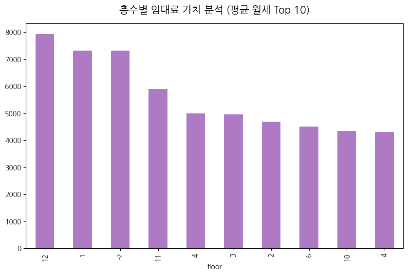

- **반전**: 11-12층 고층부 월세가 최상위권
- **이유**: 대형 빌딩 오피스 및 스카이라운지 가치 반영
- **제언**: 업종 특성에 맞는 층수 선택으로 임대료 효율 극대화

<!--
(시각화 4 - 14:00~16:00)
이 차트는 아마 오늘 발표에서 가장 흥미로운 부분일 겁니다. 상식적으로 1층 임대료가 가장 비싸야 할 것 같지만, 데이터를 열어보니 11층과 12층의 평균 월세가 1층을 상회합니다.
이는 강남의 대형 오피스 빌딩이나 고층 랜드마크 건물의 스카이라운지형 매장들이 가진 프리미엄이 반영된 결과입니다. 단순한 노출도보다는 '공간의 경험'과 '조망권'이 더 비싼 가격을 형성할 수 있다는 점을 보여줍니다.
임차인 입장에서 전략을 세운다면, 반드시 1층이어야 하는 업종이 아니라면 과감히 고층부로 올라가서 임대료 대비 더 넓은 공간과 특별한 분위기를 확보하는 것이 훨씬 경제적인 선택이 될 수 있습니다.
-->

---

## 시각화 5: 면적 vs 월세 상관관계

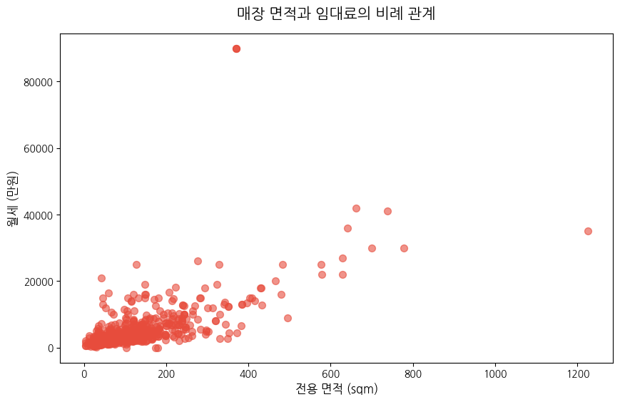

- **상관계수**: **0.62** (상대적 낮은 상관성)
- **인사이트**: '규모의 경제'보다 **'입지의 프리미엄'**이 우선
- **제언**: 업종별 최적 효율 면적(Sweet Spot) 도출 필수

<!--
(시각화 5 - 16:00~18:00)
면적과 월세의 상관계수는 0.62입니다. 앞서 보신 보증금-월세 관계보다는 훨씬 낮죠. 이것은 무엇을 의미할까요? 강남에서는 '넓다고 해서 무조건 비싸지는 것이 아니다'라는 뜻입니다. 
오히려 좁더라도 유동인구가 폭발하는 10평 남짓한 1층 상가가, 외곽의 100평짜리 상가보다 훨씬 비쌀 수 있다는 부동산의 제1법칙을 여실히 보여줍니다.
투자자나 사업자는 무조건 넓은 공간을 찾기보다는, 해당 업종이 돌아갈 수 있는 '최소 효율 평수'를 찾고, 남는 예산을 차라리 더 좋은 입지에 투입하는 전략이 유효하다는 결론에 도달합니다.
-->

---

## 시각화 6: 가격 유형 비율

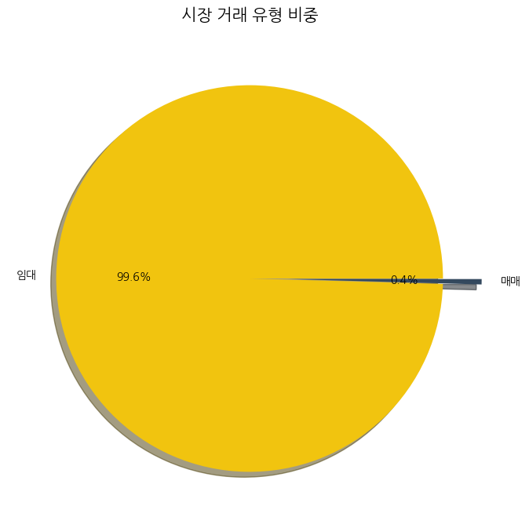

- **현황**: 임대 99.6% vs 매매 극소수
- **인사이트**: 소유주들의 장기 임대 수익 선호
- **제언**: 자산 가치 안정 신호, 매수 기회는 매우 희소함

<!--
(시각화 6 - 18:00~20:00)
시장의 거래 유형을 파이 차트로 그려봤습니다. 임대가 99.6%로 압도적입니다. 강남 상가 시장은 철저하게 '현금 흐름(Cash Flow)' 중심의 시장이라는 점을 다시 한번 확인시켜 줍니다.
이 데이터는 두 가지 관점에서 해석됩니다. 첫째, 건물주들이 이 지역의 자산 가치 상승을 확신하고 있기 때문에 물건을 팔기보다는 장기적인 임대 수익을 선호한다는 것입니다. 둘째, 그만큼 신규 매수 기회가 극히 적다는 뜻이기도 합니다. 만약 매매 물건이 시장에 나온다면 그것은 매우 귀한 기회이거나, 혹은 반대로 급박한 사정이 있는 물건일 가능성이 높습니다.
-->

---

## 시각화 7: 매물 상태별 평균 조회수

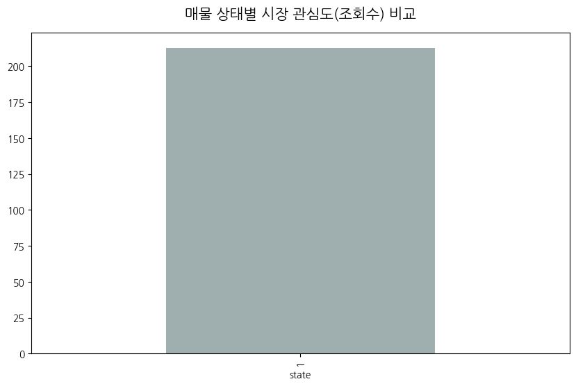

- **인사이트**: 신규/조건 변경 매물에 대한 초고속 반응
- **제언**: 실시간 모니터링과 빠른 의사결정 프로세스 필수

<!--
(시각화 7 - 20:00~22:00)
이 그래프는 시장의 반응 속도를 보여줍니다. 매물 상태에 따른 조회수 분석 결과, 특정 조건에 부합하는 매물들은 시장에 나오자마자 엄청난 수의 잠재 임차인들에게 노출됩니다.
강남 시장은 정보의 대칭성이 매우 높은 곳입니다. 좋은 매물은 남들에게도 좋습니다. 결국 성공적인 입지 선점은 '누가 더 빨리 정보를 캐치하고 현장을 방문하느냐'라는 속도전에서 결정됩니다. 
실제로 조회수가 급증하는 매물들은 등록 후 며칠 내로 계약이 성사되는 경우가 많으므로, 전략적 창업자라면 실시간 알림 시스템을 갖춘 플랫폼을 적극적으로 활용해야 합니다.
-->

---

## 시각화 8: 면적 분포 (Size Dist)

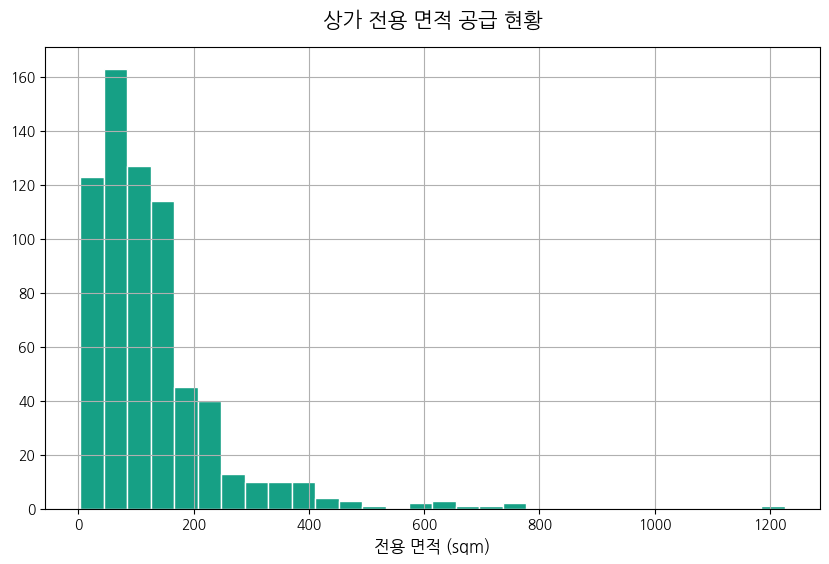

- **메인 스트림**: 100sqm(약 30평) 미만 중소형 상가
- **인사이트**: 1인 창업 및 소규모 프랜차이즈 최적화 시장
- **제언**: 건물주는 분할 임대 전략, 대형 브랜드는 공급 부족 대비

<!--
(시각화 8 - 22:00~24:00)
면적의 분포를 히스토그램으로 그려보니 100제곱미터, 즉 약 30평 미만의 중소형 상가가 주를 이룹니다. 현재 강남 상권의 임대차 트렌드가 '소형화'와 '효율화'에 집중되어 있음을 보여줍니다.
1인 창업자나 소형 프랜차이즈에게는 선택지가 넓지만, 반대로 대형 플래그십 스토어를 운영하려는 브랜드들에게는 적합한 매물을 찾기가 매우 어려운 상황입니다.
건물주 입장에서는 커다란 통임대 매물을 고집하기보다는, 이를 중소형으로 쪼개서 임대하는 것이 공실 리스크를 줄이고 평당 임대 수익을 극대화하는 훨씬 영리한 전략이 될 것입니다.
-->

---

## 시각화 9: 관심등록수 추이

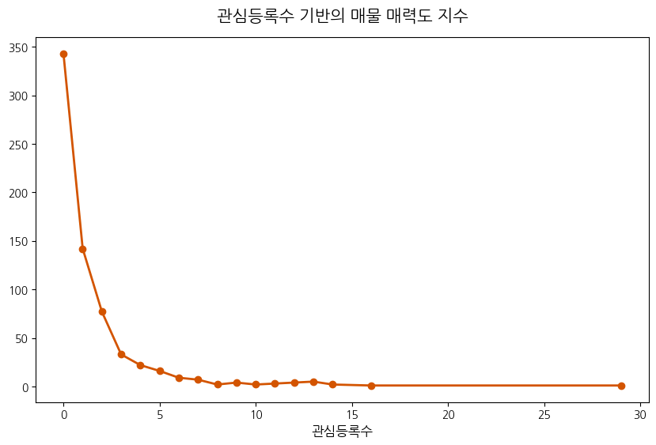

- **인사이트**: 소수의 '스타 매물'에 관심 집중
- **제언**: 관심도 급증 매물 발견 시 즉각적인 권리 분석 필요

<!--
(시각화 9 - 24:00~26:00)
관심등록수는 조회수보다 훨씬 더 강력한 '계약 의지'의 지표입니다. 보시다시피 대부분의 매물은 0건이나 1건이지만, 10건이 넘어가는 매물들이 우측에 작게 존재합니다. 
이런 매물들이 바로 우리가 말하는 'A급 매물'입니다. 가격, 위치, 권리금 조건이 삼박자를 갖춘 경우죠. 이런 매물들이 데이터에 포착된다면 망설일 시간이 없습니다. 
우리는 단순히 리스트를 보는 것이 아니라, 이 관심도의 변화 추이를 모니터링함으로써 시장의 핫스팟이 어디로 이동하고 있는지 정밀하게 추적할 수 있습니다.
-->

---

## 시각화 10: 관리비 vs 월세 상관관계

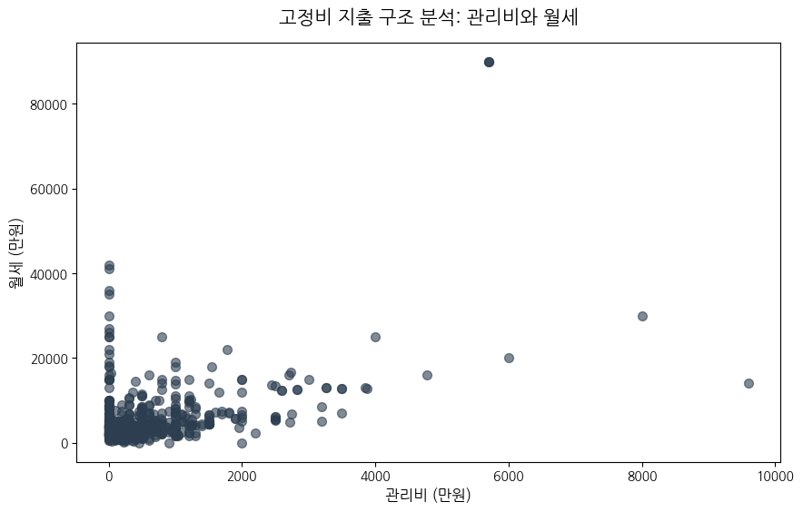

- **상관계수**: **0.48**
- **인사이트**: 프라임 빌딩의 높은 유지비용(Occupancy Cost)
- **제언**: 월세 외 관리비 합산 실질 유지비용으로 예산 수립

<!--
(시각화 10 - 26:00~28:00)
관리비와 월세의 관계입니다. 상관계수가 0.48로 나타납니다. 아주 강하진 않지만 유의미한 양의 관계입니다. 이는 소위 말하는 '프라임 급' 빌딩일수록 임대료도 높지만 전문적인 관리 인력이 투입되면서 관리비 또한 높게 책정된다는 것을 뜻합니다.
임차인들이 흔히 하는 실수가 '월세'만 생각하고 예산을 잡는 것입니다. 하지만 강남의 대형 빌딩은 관리비가 월세의 20~30%에 육박하는 경우도 많습니다. 
진정한 의미의 '운영 고정비'를 산출하려면 반드시 이 두 지표를 합산한 데이터로 의사결정을 내려야 하며, 관리비가 비정상적으로 높은 곳은 건물의 노후도나 관리 주체의 효율성을 의심해 봐야 합니다.
-->

---

## 시각화 11: 주요 키워드 분석 (TF-IDF)

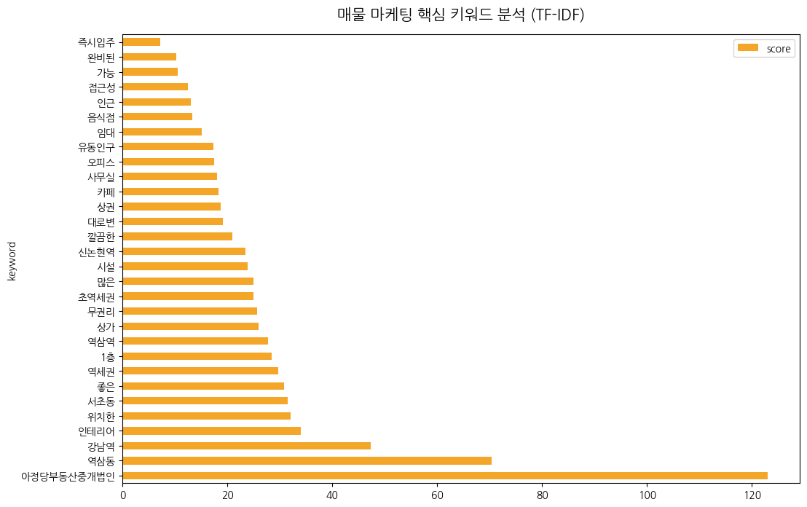

- **핵심 키워드**: #역세권 #강남역 #무권리 #인테리어완비
- **인사이트**: 초기 투자비 절감 욕구 및 입지 강조 뚜렷
- **제언**: 마케팅 시 고가치 키워드 전략적 배치로 CTR 향상

<!--
(시각화 11 - 28:00~30:00)
마지막 시각화 지표인 키워드 분석입니다. TF-IDF 기법을 통해 매물 제목에서 가장 가치 있는 단어들을 뽑아봤습니다. '강남역', '역세권' 같은 입지 키워드는 당연하지만, 눈에 띄는 것은 '무권리'와 '인테리어 완비'입니다.
이는 현재 시장 참여자들이 '초기 투자 비용'을 줄이는 데 혈안이 되어 있다는 점을 명확히 보여줍니다. 불확실성이 큰 경제 상황에서 리스크를 최소화하려는 심리가 반영된 것이죠.
매물을 내놓는 임대인이나 중개업자라면 이 네 가지 키워드를 제목에 어떻게 배치하느냐에 따라 클릭률이 수십 배 차이 날 수 있다는 실전 마케팅 팁을 데이터가 알려주고 있습니다.
-->

---

## 5. 전략적 제언: 승리하는 비즈니스 전략

### 1. 거시적 시장 진단
- 시장 투명성은 높으나 입지 계급화 고착화
- 무권리 매물 증가는 상권 생태 주기 단축을 의미

### 2. 임차인 생존 전략
- **경량 창업**: '인테리어 완비' 매물을 활용한 초기 투자비 절감
- **디지털 입지**: 물리적 위치보다 SNS 목적형 방문 유치 역량이 핵심

### 3. 임대인 자산 관리
- **선행 지표 활용**: 조회수/관심도 저조 시 즉각적인 혜택(렌트프리 등) 제공
- **공간 경험 강화**: 상층부의 특화 설계로 전체 수익률 제고

<!--
(전략 제언 - 30:00~32:00)
이제 결론을 맺겠습니다. 강남 상가 시장에서 승리하기 위한 세 가지 전략입니다.
첫째, 거시적으로 이 시장은 '초양극화'되어 있습니다. 평균의 함정에 빠지지 마십시오. 핵심 입지는 여전히 비싸지만, 무권리 매물 속에서 진주를 찾는 안목이 필요합니다.
둘째, 임차인들은 '경량 창업'을 해야 합니다. 데이터가 보여준 것처럼 인테리어가 완비된 무권리 상가를 찾아 초기 비용을 아끼고, 그 자금을 온라인 마케팅에 투자하여 '디지털 입지'를 구축하는 것이 현대적인 성공 방정식입니다.
셋째, 임대인들은 데이터 기반의 유연한 자산 관리가 필요합니다. 조회수가 낮다면 가격을 깎기보다 렌트프리 같은 혜택을 선제적으로 제안하고, 상층부 오피스를 단순한 사무실이 아닌 '공간의 경험'을 주는 장소로 업그레이드하여 가치를 높여야 합니다.
-->

---

# <!-- fit --> 감사합니다. Q&A

**Nemo 데이터로 읽는 강남 상권의 미래**

[이슈 리포트로 돌아가기](https://github.com/leehyeji020108/wiset-inflearn-nemo/issues/2)

<!--
(마무리 - 32:00~34:00)
이상으로 Nemo 상가 데이터를 활용한 강남 상권 EDA 분석 발표를 마치겠습니다. 
우리는 673개의 매물 데이터 속에서 강남의 차가운 현실과 뜨거운 기회를 동시에 보았습니다. 데이터는 결코 거짓말을 하지 않습니다. 이 분석 결과가 여러분의 비즈니스 의사결정에 든든한 이정표가 되기를 진심으로 바랍니다.
추가적인 궁금증이나 상세 분석 데이터가 필요하시면 언제든 질문해 주시기 바랍니다. 긴 시간 경청해 주셔서 감사합니다.
-->
